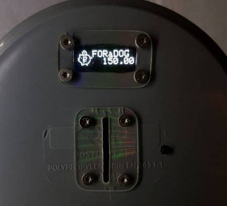

# Копилка для монет
Идея оригинальной копилки принадлежит [Alex Gyver](https://github.com/AlexGyver/MoneyBox_counter)

* Умеет распознавать монеты разного достоинства (стандарт 1,2,5,10р)
* Очень энергоэффективна: 5мкА в режиме сна, 10мА в режиме работы
* Возможность отображения детальной статистики по количеству монет каждого номинала

## Принцип работы
При включении системы из EEPROM в RAM загружаются 2 массива(словаря): номиналы монеты и их сигналах, номинал монеты и количество монет для этого номинала. Общая сумма, отображаемая на экране, рассчитывается как сумма перемноженных номиналов монет на их количество.

В режиме ожидания непрерывно опрашивается датчик, и как только сигнал начнет уменьшаться, система станет записывать данные и искать среди них максимальное до тех пор, пока сигнал не вернется к исходному(монета пролетела). Сравнивая полученное значение с датчика с сохраненными занчениями для каждого номинала, будет найдено наиболее близкое к нему. Значение монеты для указанного сигнала увеличивает количество монет в словаре. Эти данные записываются в RAM.

Через 15с бездействия система засыпрает. Перед уходом в сон система обнвляет словари данных в EEPROM новыми данными из RAM. Это дает возможность погружать систему в глубокий сон с низким энергопотреблением(5мкА). Пониженное энергопотребление МК стало возможным благодаря снижению питания до 3,7В и понижению частоты МК до 8МГц. В таком режиме система корректно работает вплоть до 2,8В. Хотя, нужно понимать, что данные с датчика при понижении напряжения будут уменьшаться и, как следствие, качество распознавания может упасть.

### Калибровка
 При включении с зажатой кнопкой serivce запускается сервисный режим. Если продолжать ее удерживать 3с после включения МК, память о загруженных монетах будет стерта. Далее МК переходит в режим калибровки. Нужно по очереди опусткать номиналы монет: 1,2,5,10р. Соответствующие значения и данные с датчика будут отображены на экране. После калибровки система перейдет в режим ожидания монет.

### Режим ожидания
В выключенном состоянии нажать кнопку пробуждения. В течение 15с система будет ожидать монеты. Каждое опускание монеты обнуляет таймер. Если удерживать в течение 3с кнопку пробуждения, то можно увидеть детальную статистику по монетам: номинал => количество (сигнал).